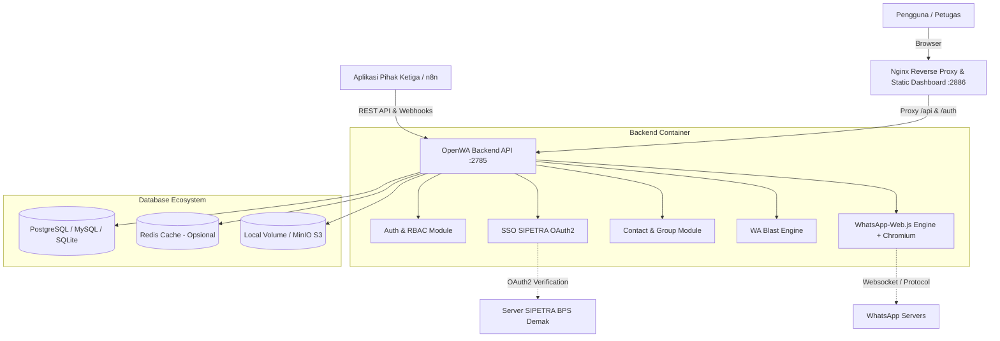

<p align="center">
  
</p>

<h1 align="center">OpenWA</h1>
<p align="center">
  <strong>Enterprise WhatsApp API Gateway, Contact Management & Smart Broadcasting Platform</strong>
</p>

<p align="center">
  <a href="#-fitur-utama">Fitur Utama</a> •
  <a href="#-quick-start">Quick Start</a> •
  <a href="#-deployment-production">Deploy Production</a> •
  <a href="#-konfigurasi-env">Konfigurasi .env</a> •
  <a href="#-api-examples">API Examples</a> •
  <a href="#-changelog">Changelog</a>
</p>

<p align="center">
  
  
  
  
  
  
  
  
</p>

---

## 🌟 Tentang OpenWA

**OpenWA** adalah platform WhatsApp API Gateway dan manajemen kontak mandiri (*self-hosted*) yang dirancang untuk kebutuhan institusi, organisasi, maupun pengembang aplikasi. Dibangun di atas NestJS dan React, OpenWA menggabungkan kestabilan gateway pesan WhatsApp dengan manajemen kontak berbasis Excel, pengelompokan wilayah, Single Sign-On (SSO SIPETRA BPS Demak), isolasi privasi multi-pengguna, serta fitur *Personal Blast* (pengiriman pesan 1-ke-1 massal) yang aman dari banned.

Arsitektur OpenWA bersifat **pluggable & database-agnostic**: Anda dapat beralih antara SQLite (pengembangan lokal) dan PostgreSQL / MySQL (production) serta media penyimpanan lokal atau S3/MinIO hanya dengan mengubah konfigurasi environment tanpa mengubah kode aplikasi.

---

## 🎯 Fitur Utama

### 🔐 1. Autentikasi Terpadu & SSO SIPETRA (BPS Demak)
- **Login OAuth2 Terintegrasi**: Masuk ke Web Dashboard secara langsung menggunakan akun **SIPETRA** (Single Sign-On BPS Kabupaten Demak) maupun API Key.
- **Sinkronisasi Profil Otomatis**: Identitas nama, email, NIP, dan avatar disinkronkan langsung ke entitas User.
- **Role-Based Access Control (RBAC)**: Pengelolaan hak akses tingkat `ADMIN` dan `USER`. Admin memiliki visibilitas global, sementara User mengelola sesi, kontak, dan grup miliknya sendiri.
- **Master API Key**: Dukungan kunci global melalui environment untuk otomasi sistem backend.

### 👥 2. Manajemen Kontak Cerdas & Import Excel
- **Import Excel (.xlsx / .xls)**: Unggah ribuan kontak langsung dari template spreadsheet dengan pemetaan otomatis.
- **Standardisasi Nomor Otomatis**: Konversi format nomor lokal (`08xx`, `+62xx`, `62xx`) menjadi format WhatsApp standar internasional (`628xxx@c.us`).
- **Pengelompokan Berbasis Wilayah**: Pengelompokan kontak berdasarkan metadata wilayah kerja (Kecamatan, Desa/Kelurahan, SLS).
- **Metadata Anggota Fleksibel**: Setiap anggota grup dapat menyimpan atribut khusus (jabatan, wilayah, status verifikasi, catatan).

### 🔒 3. Isolasi Privasi Data (Private vs Shared)
- **Multi-Tenancy Ownership**: Setiap kontak dan grup sistem terhubung dengan ID pemilik pembuatnya (`ownerApiKeyId`).
- **Privacy Toggle**: Pengguna dapat menentukan apakah kontak atau grup bersifat **Privat** (hanya terlihat oleh pemilik) atau **Shared / Publik** (dapat diakses bersama oleh tim).
- **Bulk Action Toolbar**: Fasilitas seleksi banyak baris (*multi-select*) untuk mengubah status privasi secara massal atau melakukan penghapusan massal (*bulk delete*).

### 🚀 4. WhatsApp Personal Blast (Broadcasting 1-ke-1)
- **Personalized Messaging**: Kirim pesan personal langsung ke kontak individual menggunakan template variabel dinamis, seperti `Halo {{name}}, berikut pengingat tugas...`.
- **Anti-Spam & Anti-Ban Delay**: Konfigurasi jeda interval antar pesan (default 3–5 detik) untuk menjaga keamanan akun WhatsApp.
- **Targeting Fleksibel**: Kirim pesan ke seluruh anggota grup sistem atau hanya anggota-anggota tertentu yang dipilih dari tabel.
- **Real-Time Progress Tracking**: Indikator progres pengiriman interaktif dengan status sukses/gagal per nomor tujuan.
- **Pembuatan WhatsApp Group Otomatis**: Buat grup resmi di WhatsApp Web langsung dari daftar kontak yang dipilih di dashboard.

### 📱 5. Multi-Session WhatsApp Engine
- **Multi-Session Independen**: Kelola banyak nomor WhatsApp sekaligus dalam satu server tanpa saling tumpang-tindih.
- **QR Code Web Scanner**: Pindai kode QR untuk menghubungkan sesi WhatsApp langsung dari tampilan dashboard interaktif.
- **Webhook Real-Time**: Kirim event pesan masuk, status sesi, dan tanda terima pesan (*read receipts*) ke webhook pihak ketiga dengan verifikasi tanda tangan HMAC-SHA256.
- **Dukungan Media Lengkap**: Kirim dan terima dokumen (PDF, Excel), gambar, audio, stiker, dan video.

### 🐳 6. Smart Production Deployment (`deploy.sh`)
- **Selective Docker Build**: Skrip [deploy.sh](file:///d:/Coding/OpenWA/deploy.sh) cerdas yang hanya mem-build ulang image yang terpengaruh perubahan kode (`src/` untuk Backend, `dashboard/` untuk Frontend).
- **Zero-Downtime Config Update**: Jika hanya dokumentasi atau file konfigurasi `.env` yang berubah, proses build dilewati dan container langsung diperbarui dalam 2 detik.
- **Pelacakan State (`.deploy_commit`)**: Skrip mengingat commit terakhir yang berhasil di-deploy sehingga diff selalu akurat bahkan setelah `git pull` manual.
- **Auto Database Initialization**: Service `db-init` di Docker Compose yang otomatis membuat database jika belum tersedia sebelum backend dijalankan.

---

## 🏗️ Arsitektur Sistem & Tech Stack



| Lapisan / Layer | Teknologi yang Digunakan |
| :--- | :--- |
| **Backend Framework** | [NestJS 11.x](https://nestjs.com/) (Node.js 22 LTS, TypeScript 5.x) |
| **Frontend Dashboard** | [React 18](https://react.dev/), Vite, Tailwind CSS, Lucide Icons |
| **WhatsApp Engine** | [whatsapp-web.js](https://wwebjs.dev/) didukung Headless Chromium |
| **ORM & Database** | [TypeORM](https://typeorm.io/) mendukung PostgreSQL, MySQL, dan SQLite |
| **Autentikasi** | API Key Auth + OAuth2 OpenID Connect (SIPETRA BPS Demak) |
| **Kontainerisasi** | Docker Multi-stage Builds & Docker Compose |
| **Web Server / Proxy** | Nginx Alpine (Frontend container & API proxy) |

---

## 🚀 Quick Start (Pengembangan Lokal)

### 1. Prasyarat
- **Node.js**: Versi 20 LTS atau 22 LTS
- **NPM**: Versi 10+
- **Git**

### 2. Instalasi & Menjalankan Lokal

```bash
# 1. Clone repository
git clone https://github.com/muhshi/openWasap.git
cd openWasap

# 2. Salin template konfigurasi
cp .env.example .env

# 3. Install dependency backend & dashboard
npm install

# 4. Jalankan backend dan frontend secara bersamaan (Hot-Reload)
npm run dev
```

Aplikasi dapat diakses melalui browser:
- **Web Dashboard**: [http://localhost:2886](http://localhost:2886) (atau [http://127.0.0.1:8080](http://127.0.0.1:8080) jika menggunakan port default SIPETRA)
- **REST API Docs (Swagger)**: [http://localhost:2785/api/docs](http://localhost:2785/api/docs)
- **Health Check API**: [http://localhost:2785/api/health](http://localhost:2785/api/health)

---

## 🏭 Deployment Production (Server Ubuntu / Debian)

Untuk menjalankan OpenWA di server production menggunakan Docker dan database PostgreSQL / MySQL eksternal, gunakan skrip otomatisasi yang disediakan:

### 1. Persiapan Server
Pastikan Docker dan Docker Compose sudah terpasang di server Anda:
```bash
docker --version
docker compose version
```

### 2. Konfigurasi Environment Production
Salin `.env.example` ke `.env` di server Anda:
```bash
cp .env.example .env
nano .env
```
Sesuaikan konfigurasi database server dan kredensial SIPETRA Anda.

### 3. Jalankan Smart Deploy Script
Gunakan skrip [deploy.sh](file:///d:/Coding/OpenWA/deploy.sh) untuk deployment cerdas:

```bash
# Berikan izin eksekusi pada skrip
chmod +x deploy.sh

# Jalankan deploy cerdas (otomatis mendeteksi perubahan kode)
./deploy.sh
```

#### Opsi Perintah Deploy:
| Perintah | Fungsi |
| :--- | :--- |
| `./deploy.sh` | Deploy cerdas: hanya build image jika kode service terkait berubah di Git |
| `./deploy.sh backend` | Paksa build hanya service Backend (`openwa`) |
| `./deploy.sh dashboard` | Paksa build hanya service Dashboard (`openwa-dashboard`) |
| `./deploy.sh --build` | Paksa build kedua service dengan cache |
| `./deploy.sh --force` | Paksa rebuild seluruh layer tanpa cache (`--no-cache`) |
| `./deploy.sh -y` | Menjalankan proses secara non-interaktif (cocok untuk CI/CD) |

---

## ⚙️ Konfigurasi Environment (`.env`)

Berikut adalah parameter konfigurasi penting yang dapat Anda sesuaikan di file `.env`:

```env
# ===== PORT APLIKASI =====
API_PORT=2785
DASHBOARD_PORT=2886

# ===== DATABASE (PostgreSQL / MySQL / SQLite) =====
DATABASE_TYPE=postgres               # Pilihan: postgres | mysql | sqlite
DATABASE_HOST=10.133.21.24           # IP atau hostname database
DATABASE_PORT=5433                   # Port database (5432 / 5433 untuk Postgres, 3306 untuk MySQL)
DATABASE_NAME=openwa                 # Nama database (akan dibuat otomatis oleh db-init jika belum ada)
DATABASE_USERNAME=bpsdemak
DATABASE_PASSWORD=rahasia_database
DATABASE_SYNCHRONIZE=true            # True untuk migrasi otomatis aman

# ===== DOCKER NETWORK =====
# Hubungkan ke network container database yang sudah ada
EXTERNAL_NETWORK=postgres-stack_ai_net

# ===== SSO SIPETRA (BPS DEMAK) =====
SIPETRA_CLIENT_ID=019fff3b-0a53-702d-93de-xxxxxxxxx
SIPETRA_CLIENT_SECRET=kunci_rahasia_client_sipetra
SIPETRA_REDIRECT_URI=http://127.0.0.1:8080/auth/sipetra/callback
SIPETRA_BASE_URL=https://bpsdemak.com
DASHBOARD_URL=http://127.0.0.1:8080

# ===== ENGINE WHATSAPP =====
ENGINE_TYPE=whatsapp-web.js
SESSION_DATA_PATH=./data/sessions
PUPPETEER_HEADLESS=true
```

---

## 📡 Contoh Penggunaan REST API

### 1. Membuat & Memulai Sesi WhatsApp
```bash
# Buat sesi baru
curl -X POST http://localhost:2785/api/sessions \
  -H "Content-Type: application/json" \
  -H "X-API-Key: YOUR_API_KEY" \
  -d '{"name": "sesi-layanan-demak"}'

# Dapatkan QR Code untuk pairing
curl http://localhost:2785/api/sessions/{sessionId}/qr \
  -H "X-API-Key: YOUR_API_KEY"
```

### 2. Mengirim Pesan Teks
```bash
curl -X POST http://localhost:2785/api/sessions/{sessionId}/messages/send-text \
  -H "Content-Type: application/json" \
  -H "X-API-Key: YOUR_API_KEY" \
  -d '{
    "chatId": "6281234567890@c.us",
    "text": "Halo! Ini adalah notifikasi resmi dari OpenWA."
  }'
```

### 3. Personal Blast ke Anggota Grup Kontak
```bash
curl -X POST http://localhost:2785/api/contact-groups/{groupId}/blast \
  -H "Content-Type: application/json" \
  -H "X-API-Key: YOUR_API_KEY" \
  -d '{
    "sessionId": "sesi-layanan-demak",
    "message": "Halo Bapak/Ibu {{name}}, dimohon untuk segera melengkapi data survei.",
    "delayMs": 4000
  }'
```

---

## 📁 Struktur Direktori Proyek

```
OpenWA/
├── dashboard/                  # Aplikasi Frontend (React 18 + Vite)
│   ├── nginx.conf              # Konfigurasi Nginx Production & Proxy
│   ├── Dockerfile              # Dockerfile Frontend Multi-Stage
│   └── src/
│       ├── pages/              # Halaman Dashboard (Contacts, Sessions, Logs, Login, dll.)
│       └── services/           # Service komunikasi REST API & state
├── src/                        # Backend API (NestJS 11)
│   ├── modules/
│   │   ├── auth/               # Autentikasi, API Key, User Entity & SSO SIPETRA
│   │   ├── contact/            # Kontak Impor, Grup Sistem, dan Blast Personal
│   │   ├── session/            # Pengelolaan Sesi WhatsApp & Pairing
│   │   ├── message/            # Dispatcher Pesan (Teks, Media, Lokasi, dll.)
│   │   ├── group/              # WhatsApp Groups API
│   │   └── webhook/            # Pengiriman Webhook Berlangganan
│   ├── database/
│   │   └── migrations/         # Migrasi Database Skema Multi-Dialect
│   └── engine/                 # Implementasi WhatsApp Engine (whatsapp-web.js)
├── docker-compose.prod.yml     # Konfigurasi Docker Production Multi-Container
├── docker-compose.dev.yml      # Konfigurasi Docker Development
├── deploy.sh                   # Skrip Smart Deployment Otomatis
└── README.md                   # Dokumentasi Utama
```

---

## 📝 Changelog

### [2026-09-11] — Smart Deployment, SSO SIPETRA Production Setup & PostgreSQL Migration Fixes

- **Selective Docker Build & State Persistence di `deploy.sh`**: Memperbarui skrip deployment agar mendeteksi perubahan git diff secara cerdas (`git diff --name-only`) dengan pelacakan commit deployment terakhir (`.deploy_commit`). Build hanya dijalankan untuk service yang mengalami perubahan kode (hanya Backend jika folder `src/` dsb berubah, hanya Dashboard jika folder `dashboard/` berubah, atau lewati build sepenuhnya jika hanya dokumen/skrip/konfigurasi yang berubah). Mendukung argumen `backend`, `dashboard`, `--build`, `--force`, dan `-y`.
- **Penamaan Image Konsisten di `docker-compose.prod.yml`**: Menetapkan tag eksplisit `openwa-api:latest` dan `openwa-dashboard:latest` untuk mempermudah pengecekan ketersediaan image di server host.
- **Konfigurasi & Routing SSO SIPETRA di Production**:
  - Menambahkan proxy location `/auth/sipetra/` di `dashboard/nginx.conf` agar permintaan login dan callback OAuth2 SIPETRA diteruskan dengan benar ke container backend di lingkungan Docker production.
  - Meneruskan variabel environment `SIPETRA_CLIENT_ID`, `SIPETRA_CLIENT_SECRET`, `SIPETRA_REDIRECT_URI`, `SIPETRA_BASE_URL`, dan `DASHBOARD_URL` ke container `openwa` di `docker-compose.prod.yml`.
- **Perbaikan Kompatibilitas Migrasi Database (PostgreSQL)**:
  - Merevisi 4 file migrasi dari branch `ejay` (`ContactGroupMemberMetadata`, `AddIsSharedToContacts`, `UpdateApiKeyRoleToUser`, `AddUserAndSso`) agar kompatibel penuh dengan PostgreSQL tanpa error tipe data `datetime` dan tanpa perintah `DROP TABLE` untuk menjaga keamanan dan integritas data.
- **Perbaikan Kompilasi Backend & Dashboard**:
  - Menambahkan import dekorator `Put` di `imported-contact.controller.ts`.
  - Memperbaiki properti interface `ownerApiKeyId` di `dashboard/src/services/api.ts` dan menghubungkan fungsi bulk update/delete privacy di `dashboard/src/pages/Contacts.tsx`.

### [2026-06-06] — Master API Key, Database Agnostic Columns & Group Member Blast

- **Master API Key Support**: Menambahkan validasi `API_MASTER_KEY` dari environment variabel `.env` di `AuthService`. Jika kunci yang dikirimkan cocok dengan master key, user otomatis mendapatkan peran `ADMIN` dengan akses global.
- **Database-Agnostic Column Types**: Mengganti PostgreSQL-specific `'timestamptz'` dan `'jsonb'` pada entitas `ApiKey` dan `AuditLog` dengan helper `dateColumnType()` dan `jsonColumnType()` agar skema database lebih fleksibel/database-agnostic (misal SQLite/PostgreSQL/MySQL).
- **Filter Blast WA Per Anggota (Specific Member Blast)**: Memperbarui endpoint `/contact-groups/{id}/blast` dan service `ContactGroupService` agar dapat menerima daftar opsional `memberIds` untuk melakukan blast pesan ke anggota grup tertentu saja (bukan semua anggota).
- **UI Peningkatan Halaman Kontak (Contacts Page)**:
  - Menambahkan pagination untuk daftar anggota grup dalam detail grup (`groupPageSize` dan `currentGroupPage`).
  - Menambahkan modal "Tambahkan Kontak ke Group" dari daftar kontak terpilih (multi-select), lengkap dengan opsi membuat grup baru secara instan.
  - Mendukung blast pesan ke anggota grup tertentu yang dipilih langsung dari UI detail grup.

### [2026-05-29] — Production PostgreSQL Deployment Fix

- **Switch Database ke PostgreSQL**: Migrasi konfigurasi production dari MySQL ke PostgreSQL eksternal yang sudah tersedia (`postgres-stack_ai_net`). Update `docker-compose.prod.yml` dan `.env.example` untuk menggunakan koneksi PostgreSQL.
- **Auto-Create Database via Container**: Menambahkan service `db-init` di `docker-compose.prod.yml` menggunakan image `postgres:alpine` yang otomatis membuat database `openwa` jika belum ada sebelum API container dijalankan. Tidak perlu install `psql` di server.
- **Full MySQL Support di Kode**: Menambahkan MySQL datasource di `data-source.ts` dan branch `mysql` di kedua koneksi TypeORM (`main` & `data`) di `app.module.ts`.
- **Fix Bootstrap `.env.generated`**: Memperbaiki `main.ts` agar saat generate file konfigurasi awal, nilai `DATABASE_TYPE` dan variabel lainnya dibaca dari `process.env` (Docker Compose) bukan hardcoded `sqlite`.
- **Fix Kompatibilitas TypeORM Entity dengan PostgreSQL**:
  - `column-types.ts`: Ganti `'timestamp'` → `'timestamptz'` untuk kolom tanggal di PostgreSQL (timezone-aware). Tambah helper `arrayColumnType()` yang mengembalikan `'jsonb'` di PostgreSQL dan `'simple-array'` di SQLite/MySQL.
  - `api-key.entity.ts`: Ganti `datetime` → `timestamptz`, `simple-array` → `arrayColumnType()`.
  - `audit-log.entity.ts`: Ganti `simple-json` → `jsonb`.
- **Fix `keyPrefix` VARCHAR Overflow**: Kolom `keyPrefix` di entity `ApiKey` diperbesar dari `varchar(8)` menjadi `varchar(20)`. Nilai aktual yang dihasilkan (`owa_k1_xxxxx`) berukuran 12 karakter — PostgreSQL strict menolak nilai yang melebihi panjang kolom, berbeda dengan SQLite.
- **Fix Dockerfile**: Hapus flag `--ignore-scripts` dari `npm ci --omit=dev` di stage `deps` agar native module `sqlite3` ter-compile dengan benar untuk koneksi `main` database.

### [2026-05-29] — Sebelumnya
- **Optimasi Build Docker (Percepatan Signifikan)**: Refactor `Dockerfile` backend dan `dashboard/Dockerfile` untuk memaksimalkan layer caching Docker:
  - Memisahkan stage instalasi prod-dependencies (`deps`) dari stage build source agar layer `npm ci --omit=dev` ter-cache secara independen—tidak perlu diulang saat source code berubah.
  - Menambahkan flag `--ignore-scripts` di builder stage untuk mencegah `postinstall` memicu instalasi duplikat dependency dashboard.
  - Menambahkan `dashboard/.dockerignore` untuk mengeksklusikan `node_modules` (100MB+) dari build context dashboard—mengurangi waktu transfer context secara dramatis.
  - Mengeksklusikan folder `dashboard/` dari build context backend via root `.dockerignore`.
  - Memindahkan `chown` hanya ke `/app/data` (bukan rekursif ke seluruh `/app`) untuk menghindari operasi chown pada ribuan file `node_modules`.
  - Menghapus key `version` yang obsolete dari `docker-compose.prod.yml`.
- **Fitur Sandbox Multi-Tenancy (Isolasi Data Eksplisit)**: Menambahkan kolom `ownerApiKeyId` ke entitas **Sessions**, **Imported Contacts**, dan **Contact Groups** untuk membatasi akses data. Setiap user (berdasarkan API Key operator/viewer yang login) kini hanya dapat melihat, membuat, mengelola, dan mem-blast sesi/kontak/grup miliknya sendiri secara privat. Peran `ADMIN` tetap memiliki akses global penuh.
- **Dukungan Database MySQL & Dependensi**: Menginstal paket driver `mysql2` untuk memfasilitasi komunikasi backend NestJS dengan database MySQL secara native.
- **Konfigurasi Deployment Docker Production**: Menyediakan file `docker-compose.prod.yml` khusus production dan file dokumentasi panduan deployment `docker-setting.md` siap pakai untuk mempermudah deploy di Ubuntu Server dengan dukungan koneksi ke database MySQL eksternal dan perutean proxy internal Nginx.
- **Pembaruan Fitur Blast WA Personal Terpadu (Unified Blast WA Modal)**: Mengintegrasikan dialog pengiriman pesan massal sehingga mendukung pengiriman ke kontak-kontak yang dipilih via checkbox, maupun ke grup sistem tertentu dari satu modal yang sama. Ditambahkan pula progress bar pengiriman real-time untuk pemantauan status pengiriman ke kontak individual.
- **Fitur Hapus Massal Kontak Terpilih (Bulk Delete)**: Menambahkan fungsionalitas untuk menghapus banyak kontak sekaligus yang dipilih melalui checkbox dengan konfirmasi keamanan sebelum eksekusi.
- **Refactor Contact Page**: Hapus tab auto-sync kontak WhatsApp yang menyebabkan loading berat saat halaman dibuka. Halaman kontak kini hanya menampilkan kontak yang diimport dari database lokal.
- **Hapus Tombol "Clear Imported"**: Tombol yang berbahaya (bisa hapus semua kontak sekaligus) dihapus dari UI. Penghapusan kontak tetap bisa dilakukan satu per satu via tombol ❌ di baris tabel.
- **Fitur System Contact Group**: Menambahkan konsep "Group" baru yang tersimpan di database lokal (bukan WhatsApp Group). Group ini digunakan untuk mengelompokkan kontak untuk keperluan blast WA personal.
  - CRUD Group: buat, edit nama/deskripsi, hapus group
  - Manajemen Anggota: tambah/hapus kontak dari group dengan UI searchable checkbox
  - Backend: Entity `ContactGroup` & `ContactGroupMember`, Service, dan REST Controller (`/contact-groups`)
- **Fitur Blast WA Personal**: Kirim pesan WhatsApp 1-1 (personal/private) ke semua anggota group sekaligus melalui sesi WA aktif. Mendukung variabel `{{name}}` untuk personalisasi nama penerima dan konfigurasi jeda antar pesan (default 3 detik).
- **Hapus Seeder Data Hardcoded**: Hapus 54 data kontak default yang di-seed otomatis saat server pertama kali boot.
- **Perbaikan Import**: Import kontak kini hanya menerima file Excel (.xlsx/.xls), tidak lagi CSV.

---

## 📄 Lisensi

Proyek ini berlisensi di bawah **MIT License** – bebas digunakan untuk kebutuhan personal maupun institusi/komersial.

Lihat [LICENSE](./LICENSE) untuk informasi lebih lanjut.

---

<div align="center">

**OpenWA** – Open Source WhatsApp Gateway, Contact Manager & Smart Broadcasting

<sub>Dikembangkan dengan ❤️ untuk kemudahan komunikasi dan integrasi data BPS Kabupaten Demak</sub>

</div>
